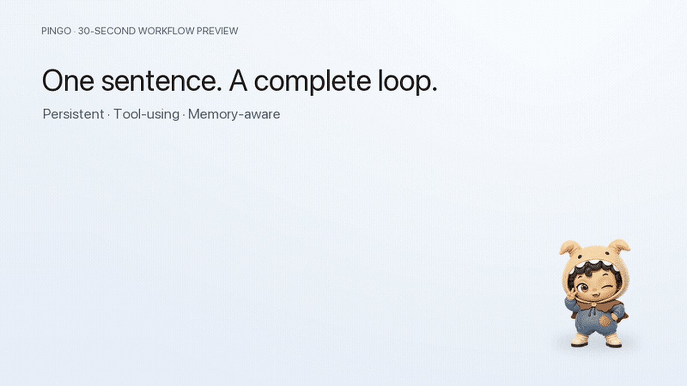

# Pingo

[中文](./README.zh-CN.md) | **English**

<p align="center">
  <strong>A persistent desktop AI companion that remembers, uses tools, and actually gets things done.</strong>
</p>

<p align="center">
  
</p>

<p align="center">
  <sub>Ask once → inspect the project → use tools → return a result → keep the next step in context.</sub>
</p>

## One sentence in. A complete loop out.

Ask Pingo, “What’s still unfinished in my project today?” It can inspect Git status, read project tasks, call workspace-scoped tools, summarize what remains, and carry the next step forward—all from the companion already living on your desktop.

> **Cute gets your attention. Agentic earns its place.**

Pingo is not a chat window wearing a pet costume. The pet is the always-available interface to an agent that can understand your project, take visible actions, and help close the loop.

> **MVP status:** Pingo is a working early version for macOS. The storyboard above previews the product workflow using Pingo's current visual assets. Conversation context is remembered during the current app session and starts fresh after relaunch; cross-launch memory is not available yet.

## What Pingo can do

- **Stay present** — a draggable, animated desktop companion with idle, happy, thinking, and gentle states, plus tray controls.
- **Understand your workspace** — list, search, and read project files inside the directory you authorize.
- **Act through tools** — write and patch files, move items to recoverable trash, inspect Git, and run approved project quality scripts.
- **Keep you in control** — risky actions are classified, previewed, and confirmed individually; nothing executes silently.
- **Close the loop** — follow task progress, inspect results, revisit terminal history, re-run operations, and compare outputs.
- **Use your model** — DeepSeek is the default, and any Chat Completions-compatible endpoint and model can be configured.

### Built for useful autonomy—not unrestricted access

Pingo combines workspace-scoped file tools, an intent-whitelisted terminal, macOS Seatbelt sandboxing, redacted audit logs, and recoverable destructive changes. A Trusted Workspace can reduce repeated file confirmations, while terminal commands still require approval.

## Architecture

- Electron + React + TypeScript (electron-vite), SCSS for styling.
- Renderer stays `contextIsolation: true`, `nodeIntegration: false`, `sandbox: true`; it only receives task state, approval cards, and operation previews through the preload whitelist.
- Authorization, risk classification, approval tokens, path re-validation, and real execution all live in the main process.
- The pet window is a transparent, frameless always-on-top window; a tray menu controls quit and visibility.

## Requirements

- macOS (arm64; packaging targets macOS arm64)
- Node.js 20+

## Getting Started (development)

```bash
npm install
cp .env.example .env
# Fill in MODEL_API_KEY in .env
npm run dev
```

Default model is `deepseek-chat`; base URL and model name can be changed in the settings page (any Chat Completions-compatible endpoint works).

### Packaged app keys

When launched from Finder, the packaged app reads keys from the macOS user configuration directory:

```bash
mkdir -p "$HOME/Library/Application Support/pingo"
cp .env.example "$HOME/Library/Application Support/pingo/.env"
# Edit "$HOME/Library/Application Support/pingo/.env" and set MODEL_API_KEY
chmod 600 "$HOME/Library/Application Support/pingo/.env"
```

## Validation & Packaging

```bash
npm run lint
npm run typecheck
npm run test
npm run build
npm run pack:mac
```

Artifacts are written to `dist/`. The app is unsigned for now — macOS will ask to allow it on first launch; configure Developer ID signing and notarization before public distribution.

### Standalone directory test

Checks a single directory without running other tests or executing terminal commands:

```bash
PINGO_INSPECT_DIRECTORY="$HOME/Documents" npm run test:directory

# Optional: assert that a relative file exists inside the directory
PINGO_INSPECT_DIRECTORY="$HOME/Documents" \
PINGO_INSPECT_EXPECT="notes/today.txt" \
npm run test:directory
```

### AI terminal end-to-end test

Sends your raw question to the real model and lets it decide whether to call a read-only terminal intent; only the capability/confirmation flow is automated. The authorized directory defaults to the current working directory:

```bash
npm run test:ai-terminal -- --prompt "List the files under src in the current project"
```

If the question does not need the terminal, allow the test to just verify the final answer:

```bash
npm run test:ai-terminal -- --allow-no-terminal --prompt "Briefly introduce this project"
```

See [ai-terminal-directory.ts](scripts/ai-terminal-directory.ts) for the test cases.

## Mini Agent (CLI loop)

`scripts/mini-agent.ts` is a standalone agent that verifies "can the model call tools and answer from real files" without any UI. It exposes `list_files`, `read_file`, and `run_command`, and needs `MODEL_API_KEY` in `.env`:

```bash
npm run agent -- "What does the dev script in package.json do?"
npm run agent -- --debug "What git branch is this project on?"
```

It does **no permission enforcement**: commands run directly, paths are not restricted to the project, and hidden files are visible. Only context-blowup guards remain (20K chars per file read, 200 entries per listing, 60s command timeout, 6 tool-loop max). Since `.env` is visible to it, the model may send `MODEL_API_KEY` to the model service — add `.env` to `NOISY_DIRECTORIES` in the script if you mind.

## Security Model

- Structured file tools accept only relative paths inside the authorized directory; `..`, absolute paths, backslashes, symlink escapes, `.env`, secret files, sensitive directories, binaries, and oversized files are rejected by default.
- Standard mode requires per-action "allow once" confirmation for writes, patches, moves, trash, and all terminal commands; Trusted Workspace skips repeated confirmation for structured file operations only, while keeping atomic replacement, path/file state re-validation, auditing, and recoverable trash.
- Terminal accepts only structured `executable + args + cwd` intents, forcing `shell: false`, a minimal environment, timeouts, output caps, and cancellation; shell, interpreters, sudo, installs, network clients, and permanent deletes are always blocked.
- Operation history is stored in a `0600` redacted JSONL file under the app data directory; API keys, full prompts, file contents, and unredacted output are never persisted.
- Capability grants never survive an app restart; a Trusted Workspace persists only the directory choice, not any command or file grant.

## Docs

Detailed plans live under `docs/` (Chinese):

- [Architecture alignment & feature priorities](docs/ARCHITECTURE_ALIGNMENT.md)
- [Controlled file & terminal capability plan](docs/TERMINAL_CAPABILITY_PLAN.md)
- [Git management rules](docs/GIT_MANAGEMENT.md)

## License

MIT
