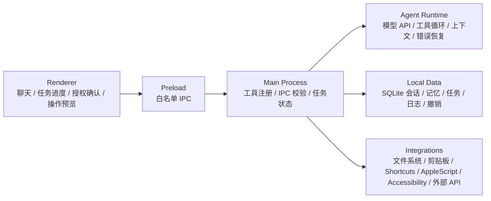

# Pingo 架构对齐与功能优先级

> 记录日期：2026-08-06

## 结论

当前代码已经完成了桌面宠物、聊天、只读项目文件工具、基础工具循环和外部 API 调用，属于一个安全的 MVP。

下面的架构图是目标形态。SQLite、Keychain、macOS 系统权限、任务状态、操作预览、确认、撤销，以及剪贴板、Shortcuts、AppleScript 和 Accessibility 集成，目前还没有完整实现。

## 产品方向：桌面伴侣

Pingo 的长期方向是“桌面伴侣”，而不是“开发工具”。产品应弱化代码阅读、项目操作和开发工作流，强化情感陪伴、日常辅助，以及持续的个性化关系。

目标体验类似 Character.AI 的桌面版，但 Pingo 需要拥有自己的性格、表达方式和长期记忆，让用户感受到这是一个长期相处的桌面伙伴，而不是一个通用聊天窗口。

### 产品重点

- 情感陪伴：日常聊天、主动关心、情绪回应、陪伴反馈和稳定一致的性格表现。
- 日常辅助：天气、提醒、轻量信息处理、文字解释/总结/翻译，以及不打断用户的桌面交互。
- 个性化关系：记住用户明确分享的偏好、习惯和重要信息，并允许用户查看、修改和删除记忆。
- 轻量工具能力：文件、代码和项目能力保留为可选辅助，不作为核心卖点，也不主导产品界面和路线。

### 商业化方向

- 订阅：提供更丰富的模型能力、长期记忆、个性化设置和持续更新的陪伴体验。
- 皮肤包：通过外观、动画、桌面主题等方式进行个性化装扮。
- 性格包：通过不同的说话方式、互动风格、兴趣设定和陪伴模式扩展角色体验。

相比开发工具，桌面伴侣的潜在用户范围更大，但会直接面对 Character.AI、桌面宠物和其他 AI 伴侣产品的竞争。Pingo 的差异化应建立在桌面原生陪伴、稳定鲜明的性格、可控且可信的长期记忆，以及对用户隐私的尊重上。

这意味着后续基础设施的优先级应从“工具调用能力”转向“人格系统、记忆系统、情绪/状态反馈和隐私可控的本地数据管理”。开发工具能力只在不破坏陪伴体验的前提下逐步补充。

## 目标架构与当前实现



| 层 | 目标架构 | 当前实现 | 对齐情况 |
| --- | --- | --- | --- |
| Renderer | 聊天界面、任务进度、授权确认、操作预览 | 聊天、流式输出、停止生成、设置、项目目录选择、工具活动提示 | 部分对齐；没有任务卡、逐操作确认和操作预览 |
| Main Process | 工具注册、macOS 权限、Keychain、IPC 校验、任务状态 | 工具注册、文件路径保护、IPC 参数校验、请求取消和超时、窗口/托盘 | 部分对齐；没有 Keychain、macOS TCC 权限、全局快捷键和持久化任务状态 |
| Agent Runtime | Responses API、工具循环、上下文压缩、错误恢复 | Chat Completions 兼容接口、最多 6 轮工具循环、请求/工具超时、取消和基础错误提示 | 部分对齐；没有 Responses API、上下文压缩、重试/恢复/重规划 |
| Local Data | SQLite：会话、记忆、任务、操作日志、撤销记录 | `settings.json` 保存设置/窗口位置/授权目录；Renderer `localStorage` 保存最近聊天 | 不对齐；没有 SQLite、长期记忆、任务、日志和撤销记录 |
| Integrations | 文件系统、剪贴板、Shortcuts、AppleScript、Accessibility、外部 API | 受限只读文件系统、模型 API、Open-Meteo 天气 API | 部分对齐；没有全局快捷键、剪贴板、Shortcuts、AppleScript、Accessibility 和文件移动能力 |

当前代码的实际边界如下：

```text
Renderer
  宠物 / 聊天 / 设置 / 项目目录选择
        │ preload 白名单 IPC
        ▼
Main Process
  IPC 校验 / 窗口 / 托盘 / 工具注册 / 模型调用 / 天气路由
        ├── Model API
        ├── Open-Meteo API
        └── 只读文件系统工具

Local Data
  settings.json + renderer localStorage
```

## 当下最重要的功能

### P0：陪伴与日常辅助基础设施——最应该先做

陪伴体验是当前最重要的产品闭环：使用频率高、关系价值持续累积，也是订阅和性格/皮肤包的基础。

- 建立稳定的 Pingo 人格、语气和互动边界。
- 设计可查看、可编辑、可删除的长期记忆模型。
- 增加情绪、陪伴状态和日常互动反馈。
- 在不打扰用户的前提下提供天气、提醒和轻量内容助手能力。

内容助手仍然是重要的日常辅助场景，但不再是产品定位本身：

- 读取当前选中文字；读取失败时回退到剪贴板。
- 对选中文字或剪贴板内容执行解释、总结、翻译、改写。
- 结果流式显示，并支持一键复制。
- 生成内容默认只展示，不自动覆盖原文或发送出去。

建议先把“读取剪贴板 → 选择任务 → 返回结果 → 复制结果”做成完整闭环，再接入 macOS 选中文字读取和替换能力。

### P1：文件助手——从只读开始扩展

文件助手应先延续当前的安全边界，再增加文件整理能力。

- 搜索文件和文档内容。
- 总结单个文档或一组文档。
- 整理 Downloads 前先生成变更预览：将移动哪些文件、移动到哪里、为什么移动。
- 用户确认后才执行移动。
- 每次移动写入操作日志，并支持撤销。

当前的 `list_files`、`search_files`、`read_file` 已经是这一方向的基础，但范围仍限于用户授权的项目目录，尚不支持 Downloads 整理、移动、预览和撤销。

### P2：行动助手——默认草稿，确认后执行

行动助手的重点不是“替用户直接操作”，而是把模型生成和外部执行明确分开。

- 根据当前文字生成邮件回复草稿。
- 根据当前文字生成待办事项草稿。
- 根据当前文字生成日历事件草稿。
- 默认只生成草稿并展示预览。
- 用户确认后，才发送邮件或创建待办/日历事件。
- 执行结果写入操作日志，失败时保留重试入口。

这部分依赖邮件、日历或任务系统集成，也依赖统一的授权确认、操作预览和任务状态模型，因此排在内容助手和文件助手之后。

## 推荐的演进顺序

```text
陪伴与日常辅助
  人格与记忆 → 日常互动 → 轻量内容助手 → 复制/提醒/反馈
       ↓
文件助手
  搜索/总结 → 变更预览 → 用户确认 → 移动文件 → 可撤销
       ↓
行动助手
  生成草稿 → 预览 → 用户确认 → 创建/发送 → 记录结果
```

陪伴、日常辅助和工具能力共用的基础设施应优先抽出来：

1. 人格与记忆模型：角色设定、用户记忆、记忆来源、查看、编辑、删除和遗忘策略。
2. 陪伴状态模型：情绪、互动阶段、主动性、打扰边界和可解释的状态反馈。
3. 统一任务模型：任务标题、阶段、状态、进度、取消、失败和重试。
4. 统一确认模型：只读、生成草稿、修改本地文件、调用外部服务分别定义确认级别。
5. 统一操作日志和撤销记录：尤其覆盖文件移动和外部发送动作。
6. macOS 安全集成：Keychain、剪贴板、选中文字读取，以及后续的 Accessibility、Shortcuts 和 AppleScript。

## 受控任务能力实现状态（2026-08-08）

当前代码已将文件/Terminal 任务接入目标架构，但仍保持“开发工具是可选辅助”的产品定位：

- `src/main/tasks/taskManager.ts` 负责 `proposed → awaiting_permission → planning → awaiting_confirmation → executing → completed/failed/cancelled` 状态、AI 工具循环、取消和事件转发。
- `src/main/security/capabilityManager.ts`、`approvalBroker.ts`、`riskClassifier.ts` 和 `auditLogger.ts` 位于 Main Process；授权按窗口/会话/真实目录范围绑定，审批按不可变 digest、短 TTL 和一次性 token 绑定。
- `SettingsStore` 额外保存用户显式创建的 Trusted Workspace；它只绑定一个真实目录，允许目录内结构化文件操作跨重启免重复授权，Terminal、项目脚本和系统自动化不继承。
- `src/main/tools/fileOperations.ts` 只实现结构化目录/文本文件操作；`write_file` 和 `apply_patch` 使用原子替换与 hash/mtime 复检，`trash_path` 只使用可恢复废纸篓。
- `src/main/terminal/commandPolicy.ts` 和 `runner.ts` 只接受白名单 executable/args/cwd，强制 `shell: false`、最小环境、超时、输出上限和取消回收。
- `src/preload/index.ts` 只暴露任务、权限、确认、审计和撤销的一事一方法；Renderer 不获得 Node、文件系统、`child_process` 或通用命令接口。
- `electron-builder.yml` 已启用 Hardened Runtime 和最小 Electron JIT entitlements；公开分发仍需用户自己的 Developer ID 签名/公证凭据。
