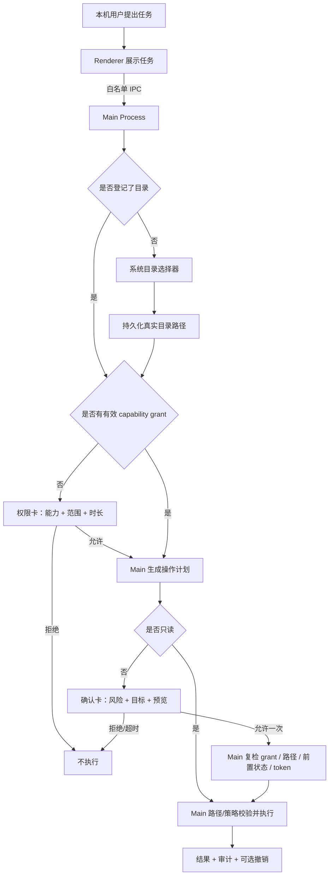

# Pingo 授权与权限管理评审（讨论稿）

> 评审日期：2026-08-08
> 依据：当前 `src/`、`tests/`、README 与 `docs/TERMINAL_CAPABILITY_PLAN.md` 代码/文档交叉核验
> 状态：Trusted Workspace 已按确认方案实现；本文同时保留发布前安全增强项，便于后续评审

## 1. 结论先行

Pingo 当前不是“账号 + 角色 + 菜单权限”的后台系统，而是一个单机桌面应用的能力授权模型：本机用户选择目录，按会话授予能力，再对每个有副作用的操作单独确认。

整体方向是正确的，尤其是以下边界值得保留：

- 模型只能提出工具请求，不能自行授权或执行。
- Renderer 只负责展示与回传决定，Main Process 才是权限与执行的最终裁决者。
- 项目访问限制在用户选择的真实目录内。
- 写入、移动、废纸篓和 Terminal 均需要逐操作确认。
- 文件执行前复检路径和文件状态，写入采用原子替换。
- 权限可撤销，操作有本地审计记录，可逆操作提供撤销入口。

但目前还不能把它表述为“权限闭环已经完全可靠”。本轮已补齐 Trusted Workspace 和普通 grant 的 persistent 拒绝；发布前仍建议处理以下高优先级问题：

1. Git 子命令参数没有完整正向白名单，可能借 `--no-index`、绝对路径、`--output` 等越过项目 PathGuard。
2. Terminal 超时/取消只发送 SIGTERM，代码没有真正执行后续 SIGKILL，进程可能在 UI 显示结束后继续运行。
3. 模型接口允许远程 `http://`，而聊天、文件片段和 API Key 会随请求发送，存在明文外泄风险。
4. `npm run` 会执行仓库任意代码，但确认卡没有展示并绑定实际 script 内容，也没有提供 OS 级沙箱。

本轮已修复的授权边界：普通 task grant 不能创建 `persistent` write/terminal；跨重启持续授权只能通过首次启动/设置页的 Trusted Workspace 专用流程创建。

建议保留现有“Capability Grant + Operation Approval”双层模型，同时增加一个由用户在首次启动时主动开启的 **Trusted Workspace（持续目录授权）**：授权后，Pingo 在所选目录内执行结构化读取和文件操作时不再重复询问。这里的“不限制权限”定义为“不重复弹权限/确认卡”，不等于取消目录边界、路径校验、审计、可恢复删除和 R4 禁止规则。

Terminal 和项目脚本不能仅靠 `cwd` 保证目录隔离：进程仍可能访问目录外文件或网络。因此建议它们不继承 Trusted Workspace，仍单独授权；如果未来希望连 Terminal 也完全放开，需要先引入真正的 OS 级沙箱，否则实际效果等同于授予 Pingo 当前 macOS 用户的全部进程权限。

## 2. 先统一术语

当前讨论里，“授权”和“权限”容易混成一件事。建议统一为六个概念：

| 概念 | 含义 | 当前实现 |
|---|---|---|
| 身份主体 | 谁在发起操作 | 没有账号系统；默认是当前 macOS 用户控制的唯一 Pingo 窗口 |
| 目录登记 | Pingo 记住可以被授权的目录范围 | 系统目录选择器选择真实目录，路径写入 `settings.json`，跨重启保留 |
| 持续目录授权 | 用户主动信任一个目录，目录内不再重复询问 | 已实现：跨重启保存单一 root；结构化文件操作免重复权限/确认卡 |
| 能力授权 | 当前窗口/会话可以做哪类事 | `workspace.read`、`workspace.write`、`terminal.execute`；Main 内存 grant |
| 操作确认 | 是否允许这一个具体副作用 | 写、移动、废纸篓、Terminal、撤销均 approve/deny，一次性、短 TTL |
| 资源校验 | 即使用户点了允许，这个目标是否仍符合策略 | Main 检查真实路径、敏感目标、文件 hash/mtime、命令白名单等 |
| 审计与恢复 | 事后能否知道发生过什么并撤销 | 0600 JSONL 操作历史；部分文件操作有内存 undo |

最关键的产品语义是：

> “记住这个目录”不等于“当前可以访问这个目录”；“拥有写能力”也不等于“可以不经确认直接修改文件”。

## 3. 当前授权链路

### 3.1 身份和信任边界

- 没有注册、登录、组织、角色或 RBAC。
- 实际主体是当前 macOS 登录用户；应用内部以唯一 Pingo `webContents` 作为请求来源。
- IPC handler 会验证 sender，只接受当前宠物窗口。
- BrowserWindow 开启 context isolation、sandbox 和 webSecurity，禁用 Renderer Node，阻止新窗口和跨来源导航。
- Preload 只暴露 project、task、capability、audit 等一事一方法接口，没有通用文件或命令执行 API。

这套模型适合当前单用户本地 MVP。只有在引入云同步、团队空间、付费权益或多人共享数据后，才需要账号认证和 RBAC。

### 3.2 目录登记

- 第一次需要文件能力时，用户通过 Electron 原生目录选择器选择目录。
- Main 将目录转换成真实路径并确认它是目录。
- 目录路径保存在 `settings.json`，应用重启后仍被记住。
- 更换或撤销项目目录会撤销所有活动 capability，并取消任务。

当前已提供“关闭持续授权”和“忘记目录”入口；关闭只撤销 Trusted Workspace 并保留最近目录，忘记会清除保存的目录记录。

### 3.3 Capability Grant

当前能力：

| Capability | 当前用途 | 当前实际确认规则 |
|---|---|---|
| `workspace.read` | 列出、搜索、读取授权目录内普通文本 | 获得 grant 后不逐文件确认 |
| `workspace.write` | 建目录、写文件、补丁、移动、废纸篓 | 先有 grant，每个操作再确认一次 |
| `terminal.execute` | 执行受限命令 | 先有 grant，每条命令再确认一次 |
| `system.automation` | 预留 | IPC 和 Main 均不允许 |

Grant 绑定 capability、真实目录 scope、窗口、session、创建/过期时间和撤销状态。Manager 默认拒绝未知能力、越权目录、过期 grant 和跨窗口使用。

普通 grant 支持 once/session 且只存 Main 内存，重启即失效；`persistent` 由 Main 拒绝。跨重启的 Trusted Workspace 使用独立记录绑定单一目录，不复用普通 grant。

### 3.4 Operation Approval

写入、补丁、移动、废纸篓、Terminal 和撤销会生成 `OperationPlan`，包含：

- operation/task/window 身份；
- capability、风险等级和风险原因；
- 目标路径或 executable/args/cwd；
- diff/动作预览；
- 文件 hash/mtime 等前置条件；
- digest、创建时间、30 秒过期时间和可撤销标记。

Renderer 只回传 taskId、operationId 和 approve/deny。批准 token 一次消费，拒绝同一 task+digest 后不会重复弹出相同计划。

### 3.5 路径、文件和命令校验

文件边界目前较强：

- 工具只接受授权根下相对路径；拒绝绝对路径、`..`、反斜杠、NUL、symlink 和 realpath 越权。
- 默认阻止 `.git`、`.ssh`、`.env`、常见私钥等敏感目标。
- 写前重新解析路径，并复检 exists/hash/mtime。
- 文本大小、行数、搜索结果和输出都有上限。
- 写入为同目录临时文件后 rename，删除只进入系统废纸篓。

Terminal 边界：

- 只接收结构化 executable、args、cwd；使用 `shell:false`，无 stdin/TTY。
- 当前只开放 pwd、ls、git status/diff/log 和 npm run。
- 有 30 秒超时、128KB 输出限制、并发上限、最小环境和输出脱敏。
- Shell、解释器、sudo、安装器、网络客户端等不允许。

### 3.6 数据外发、本地记录和撤销

- 聊天和 read_file 的返回内容会发往用户配置的模型 endpoint。
- Renderer 本身不能联网；请求由 Main 发出。
- 最近 40 条聊天保存在 Renderer localStorage。
- 操作历史保存在用户数据目录的 0600 JSONL，默认返回最近 100 条；当前设置页只展示最后 5 条简要记录。
- API Key 不返回 Renderer，但目前通过 `.env` 读取，没有使用 Keychain。
- 普通模式下 Undo 只存 Main 内存，重启后失效；Trusted Workspace 内的结构化文件操作可在当前任务生命周期内直接撤销，但仍经过目录边界和状态检查。

## 4. 当前方案做得好的地方

1. **安全裁决位置正确。** 授权、风险、路径和执行都在 Main，而不是依赖模型提示词或前端按钮。
2. **双层授权合理。** Capability 解决“能力 + 范围 + 时长”，Approval 解决“这一次具体做什么”。
3. **目录 scope 是真实路径。** realpath、relative 和 symlink 检查能阻止大量常见目录越权。
4. **执行内容可预览。** 写操作有 diff，Terminal 有完整结构化命令；拒绝或超时不会执行。
5. **文件竞态意识较强。** 预览后会复检路径和 hash/mtime，写入为原子替换。
6. **R4 默认拒绝。** 没有任意 Shell、sudo、永久删除或系统自动化入口。
7. **权限可见、可撤销、有审计。** 虽然 UI 和数据治理还不完整，但基础设施方向正确。

## 5. 需要提升的地方

### P0：发布前必须修复

| 问题 | 当前风险 | 建议 |
|---|---|---|
| Git 参数规则不是正向语法 | `--no-index`、绝对路径、`..`、`--output` 等可能读写授权根外资源 | 每个 git 子命令建立独立参数 parser；路径参数必须解析到授权根；强制 `--no-ext-diff`；拒绝所有未显式允许选项 |
| Terminal 未真正强杀进程 | 忽略 SIGTERM 的进程可在取消/超时后继续运行 | SIGTERM 后等待短 grace，随后真实发送 SIGKILL，并等待 close；按 task 追踪进程树，不使用全局 cancelAll |
| 远程 HTTP 模型接口 | API Key、聊天和文件内容可能被明文窃听 | 远程只允许 HTTPS；仅 localhost/127.0.0.1 可在高级模式使用 HTTP，并显示明确警告 |
| npm run 信任边界不清 | 仓库脚本拥有当前用户文件与网络权限，确认后脚本仍可能变化 | V1 先默认关闭；若保留，拆为 `project_script.execute`，展示 script 正文和来源，绑定 package.json hash，使用隔离 HOME，并明确“执行仓库代码” |

### P1：权限闭环和产品可信度

| 问题 | 建议 |
|---|---|
| 静态风险分级 | 按“目标敏感性、是否覆盖、变更规模、是否执行代码、是否外发”动态升级；完整 diff 的普通修改可 R2，覆盖/大批量/废纸篓/Terminal 为 R3 |
| 批准摘要未绑定完整写入内容 | digest 加入 canonical payload hash；预览可以截断，但必须显示“还有未展示内容”和全文 hash |
| Approval token 未显式绑定 plan | 保存 token→task/window/operation/digest/expiry 映射，消费时逐字段核对 |
| Capability 二次检查只传 project root | 执行前把每个实际 target/cwd 传给 `assertAllowed`，不要只证明项目根本身在 scope 内 |
| 授权根过宽和敏感规则不足 | 禁止 `/`、home、用户数据目录等危险根，或强提醒二次确认；敏感路径比较统一大小写并扩展常见凭据目录 |
| Undo 可覆盖后续用户修改 | 为 undo 记录“操作后状态”hash/mtime，撤销前重新预览和复检；无法可靠恢复时不要显示“可撤销” |
| 权限 UI 不够可解释 | 使用中文能力名，说明能做什么/不能做什么、模型服务域名、数据是否外发、精确有效期；Approval 显示倒计时和过期态 |
| 缺少目录管理 | 设置页增加“已记住目录 / 更换 / 忘记目录”；与“撤销当前能力”分开展示 |
| 本地数据不可管理 | 增加清空聊天、清空/导出操作历史、保留期限；说明 localStorage 与审计数据位置 |

### P2：长期维护和未来扩展

- Task/Undo 增加 TTL、容量和终态清理，避免旧内容和闭包长期驻留内存。
- Grant 撤销、任务取消和进程取消改为按 grant/task/process 精确关联，避免取消一个任务误伤其他任务。
- 审计补齐权限申请、拒绝、过期和自动撤销；定义轮转、保留和清除策略。需要防篡改时再加入链式 hash/HMAC。
- API Key 迁移到 macOS Keychain；`settings.json` 也显式设置 0600。
- 统一 README、TODO 和架构文档的状态标签，避免旧段落继续把已实现能力写成“未来事项”。
- 如果以后出现多窗口，capability list/revoke/audit 必须按主体或窗口过滤；不能继续依赖单窗口假设。
- 只有引入云同步、组织空间或插件 OAuth 后，才新增 accountId、tenantId、role 和 connector scope；不要把本地文件权限提前做成 RBAC。

## 6. 推荐的最终权限方案

### 6.1 主体模型

V1 定义一个明确主体：`LocalOwnerSession`。

- 所有者：当前 macOS 登录用户。
- 会话：本次 Pingo Main Process 生命周期；窗口重建时生成新 windowId。普通 grant 随应用退出失效，用户显式创建的 Trusted Workspace 跨重启保留。
- 暂不做账号登录或 RBAC。
- 云账号只负责订阅/同步时，不能自动获得本机文件或 Terminal 能力；本地资源仍需本机用户单独授权。

### 6.2 目录模型

把目录状态拆成三层：

1. **Remembered Root**：Pingo 记住目录的真实路径、展示名、登记时间；跨重启存在，但没有访问能力。
2. **Active Grant**：本次会话对这个 root 的 read/write/terminal 能力；退出、撤销或切换目录后失效。
3. **Trusted Workspace**：用户在首次启动或设置页通过独立、明确的本机操作持续授权一个 root；跨重启保留，在该 root 内自动允许结构化 read/write/move/trash，不再逐次询问。

Trusted Workspace 不能由模型工具调用、普通 task grant 或 Renderer 自行升级创建，只能来自首次启动/设置页的专用用户手势，并由 Main 写入独立授权记录。更换目录或扩大 scope 必须重新经过系统目录选择器和授权说明。

设置页同时提供：更换目录、忘记目录、撤销当前能力、关闭持续授权。选择 home、`/`、应用数据目录或其他高风险根时默认拒绝或二次强提醒。

### 6.3 V1 权限矩阵

| 能力 | 时长 | 操作确认 | 推荐规则 |
|---|---|---|---|
| 普通聊天 | 无 grant | 无 | 只发送用户输入到已配置模型服务 |
| 标准模式 `workspace.read` | once / session | 不逐文件确认 | 权限卡必须说明读取片段会发送到具体模型域名 |
| 标准模式 `workspace.write` | session | 每个操作允许一次 | 新建/完整 diff 的小修改为 R2；覆盖、大文件、大范围为 R3 |
| Trusted Workspace 文件能力 | persistent，绑定单个 root | 目录内不再询问 | 自动允许结构化 read/write/create/move/trash；仍做路径、竞态、原子写、审计与 undo |
| `terminal.execute` | session | 每条命令允许一次 | 只开放经过参数语法审核的命令；每次显示 executable/args/cwd |
| `project_script.execute` | V1 默认关闭 | 强确认一次 | 以后单独评审，不与普通 Terminal 混在一起 |
| `system.automation` | 禁止 | 不提供“强行继续” | 等具体功能与 macOS 权限模型设计完成后再开放 |

### 6.4 风险与确认

| 风险 | 规则 |
|---|---|
| R0 | 解释、规划、生成草稿；不接触本机资源，不要权限 |
| R1 | 已授权目录内只读；需要有效 read grant，不逐次弹确认 |
| R2 | 小范围且可靠可逆的文件变更；显示完整 diff/目标后允许一次 |
| R3 | 覆盖、大范围、废纸篓、任何进程执行；强提醒、短 TTL、永不记住决定 |
| R4 | 越权路径、敏感凭据、任意 Shell/解释器、提权、安装、永久删除、不受控网络或系统安全设置；Main 直接阻止 |

OperationPlan 必须绑定 canonical targets、完整 payload hash、executable identity、args/cwd、risk、preconditions 和 expiry。建议确认 TTL 调整为 60–90 秒并显示倒计时；过期后按钮禁用，重新生成预览。

Trusted Workspace 下，R1–R3 的结构化目录内文件操作仍生成 OperationPlan 并执行全部安全复检，只是不等待人工 approve。操作完成后继续写审计并提供可靠 undo。R4、目录越权、Terminal、项目脚本和系统自动化不因 Trusted Workspace 放开。

### 6.5 数据外发规则

- 远程模型只允许 HTTPS；本地开发 endpoint 例外单独开关。
- 首次使用或模型 host 改变时，明确显示“消息和你允许读取的文件片段将发送到 `host`”。
- 后续增强：创建 Trusted Workspace 时记录当前模型 host 的数据外发同意；host 改变后暂停自动读取，要求用户重新确认新的接收方。
- read grant 卡片重复显示当前 host，避免用户把“允许本地读取”误解成“内容不会离开电脑”。
- 审计不保存 prompt、文件全文或原始命令输出；默认使用授权根下相对路径。
- 用户可以清空聊天、清空/导出审计、忘记目录；这些动作应说明范围且立即生效。

## 7. 建议的用户端文案

### 7.1 首次启动：持续目录授权

> **选择一个目录并持续授权给 Pingo**
> 授权后，Pingo 可以在该目录内自动列出、读取、创建、修改、移动文件或将文件移入废纸篓，不再逐次询问。相关文件片段可能发送到 `{模型域名}` 以完成任务。
>
> Pingo 不会因此获得目录外访问、Terminal、项目脚本、永久删除或系统自动化权限。路径校验、操作记录和可用的撤销保护始终保留。你可以随时在设置中关闭持续授权或忘记该目录。

按钮：`选择目录并持续授权` / `暂不授权`

说明：对 macOS 直发应用，这一步发生在“首次启动”而不是安装器中；真正的目录范围仍由系统目录选择器确认。

### 7.2 标准模式：读取权限

> **允许 Pingo 在本次会话读取“{目录名}”吗？**
> Pingo 可以列出、搜索并读取其中的普通文本文件，不能读取目录外内容、密钥、环境变量或二进制文件。为完成任务，读取到的相关片段会发送到 `{模型域名}`。关闭 Pingo 或撤销权限后失效。

按钮：`允许本次会话` / `拒绝`

### 7.3 标准模式：写入权限

> **允许 Pingo 在本次会话提出文件变更吗？**
> 范围仅限“{目录名}”。每一次创建、修改、移动或移入废纸篓前，Pingo 都会展示目标和变更预览；只有你再次点击“允许一次”后才会执行。

按钮：`允许本次会话` / `拒绝`

### 7.4 Terminal 权限

> **允许 Pingo 在本次会话提出受限命令吗？**
> Pingo 只能运行安全策略明确允许的命令，每条命令都会展示 executable、参数和工作目录，并再次请求“允许一次”。不会开放 Shell、sudo、安装、永久删除或任意网络命令。

按钮：`允许本次会话` / `拒绝`

### 7.5 R2 文件确认

> **允许一次：修改 `{相对路径}`**
> 请检查下方完整变更。批准仅适用于本次预览；如果文件、目标或内容发生变化，Pingo 会要求重新确认。
> `可撤销 · 预计影响 1 个文件 · 01:12 后过期`

按钮：`允许一次` / `拒绝`

### 7.6 R3 Terminal 确认

> **高风险操作：运行本机进程**
> 该命令可能执行仓库代码，并以当前 macOS 用户权限访问文件或网络。Pingo 无法保证第三方脚本可撤销。请确认命令、参数和工作目录均符合你的预期。

按钮：`我已检查，允许一次` / `拒绝`

### 7.7 撤销能力与忘记目录

> **撤销当前能力**：立即停止依赖此权限的待确认和运行中任务；Pingo 仍会记住目录，便于下次重新授权。
> **关闭持续授权**：立即停止该目录内的自动执行；保留目录记录，后续改回标准逐次授权模式。
> **忘记目录**：撤销全部相关能力并删除保存的目录记录；下次使用时需要重新通过系统选择器选择。

## 8. 推荐实施顺序与剩余增强

### 第一阶段：先堵住安全边界（P0）

1. 收紧 Git 参数语法和路径约束，暂时关闭 npm run。
2. 修复 Terminal 进程树终止，按 task 精确取消。
3. 远程 endpoint 强制 HTTPS，限制 IPC 消息角色为 user/assistant。
4. （已完成）Main 强制 capability-duration 矩阵；普通 task grant 拒绝 persistent，只有专用首次启动/设置流程可以创建目录绑定的 Trusted Workspace，Terminal 永不继承。
5. 增加针对上述场景的失败测试；未通过前不扩大命令白名单。

### 第二阶段：补完整授权语义和 UX（P1）

1. 引入 Remembered Root、Active Grant、Trusted Workspace 三层状态及管理 UI。
2. 权限卡增加能/不能做什么、模型 host、数据外发、时长和失效时间。
3. 动态风险分级；完整 payload hash、token-plan 绑定和实际 target 二次检查。
4. Approval 倒计时、过期态、截断说明和脚本/命令增强预览。

### 第三阶段：数据治理和恢复（P1/P2）

1. Undo 增加操作后 precondition、TTL 和可靠性等级。
2. Task/grant/process/undo 生命周期与取消粒度收口。
3. 增加聊天/审计清理与导出、日志轮转、Keychain。
4. 同步 README、TODO、架构文档和安全回归矩阵。

## 9. 当前方案决策与后续建议

1. **首次启动持续授权覆盖哪些能力？**
   推荐：覆盖所选目录内的结构化读取、创建、修改、移动和移入废纸篓；不再逐次询问，但保留安全复检、审计和 undo。

2. **Terminal 是否继承持续目录授权？**
   推荐：不继承。Terminal 和项目脚本能访问目录外资源，不是目录授权能够安全约束的能力，仍需独立授权和逐条确认。

3. **V1 是否继续开放 npm run？**
   当前仍按 R3 逐次确认开放；后续建议先关闭，等 script 正文预览、package.json hash 绑定、隔离 HOME 和进程强杀都完成后，再作为独立高风险能力开放。

4. **模型 endpoint 和文件外发策略？**
   推荐：远程只允许 HTTPS；localhost 可显式例外；创建持续授权时显示具体域名。模型 host 改变后暂停自动读取并重新确认接收方。

Trusted Workspace 的能力范围和 Terminal 隔离已按上述方案冻结；npm run 收紧、HTTPS/localhost 策略和模型 host 数据外发确认仍列为后续增强项，当前实现不会把它们误报为已完成。

## 10. 验证基线与新增门禁

当前已有 17 个自动测试全部通过，覆盖基础 grant scope/revoke、cross-window approval、文件预览后变化、原子写、Trusted Workspace 持久化/自动文件操作和 Terminal 隔离。

Trusted Workspace 相关门禁已补充并通过；下列其余发布前增强项仍需在后续迭代完成：

- 普通 task grant 拒绝 persistent；只有专用用户手势可创建目录绑定的 Trusted Workspace；Terminal 永远不能被该授权隐式放开。
- Trusted Workspace 跨重启有效，并可在已授权 root 内自动完成结构化文件操作，不产生权限卡或逐操作确认卡。
- Trusted Workspace 不能访问 root 外目标，不能由 symlink/参数/模型请求扩大 scope；关闭或忘记后立即失效。
- read grant 过期、once 消费、应用/窗口会话变化均失效。
- approval token 不能跨 plan/digest 使用，过期/拒绝/取消底层调用为 0。
- Git 绝对路径、`..`、`--no-index`、`--output` 和未知参数全部拒绝。
- npm script 变化后旧批准失效；若 V1 关闭则所有 npm 请求拒绝。
- 超时、取消、输出爆量后父进程和全部后代进程均不存在。
- 完整写入 payload 改变后旧 digest/批准失效。
- Undo 遇到操作后用户修改时拒绝覆盖并要求重新预览。
- 远程 HTTP endpoint 被拒绝；localhost 例外需要明确设置。
- （后续增强）模型 host 改变后，Trusted Workspace 的自动读取暂停并要求重新确认数据接收方。
- 忘记目录后保存记录、活动 grant、pending approval 和关联任务全部清除。
