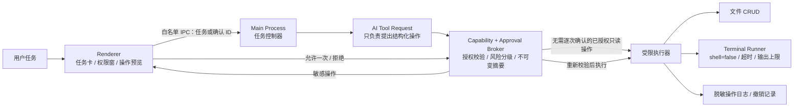

# Pingo Terminal / 电脑操作能力执行方案

> 状态：已按本方案实现并进入验证
> 日期：2026-08-08
> 目标平台：macOS、Electron + React + TypeScript

## 1. 方案结论

建议 V1 实现“结构化文件操作 + 受限 Terminal”，不要把任意 Shell 直接交给模型：

- 文件增删改查优先通过结构化工具完成，所有路径都受授权目录和路径保护约束。
- 软件首次启动时，用户可通过系统目录选择器明确授权一个 Trusted Workspace；未授权时只允许生成操作计划，不允许执行。
- 标准模式下，文件写入、移动、删除以及任何 Terminal 命令都必须在执行前展示不可变的操作预览，并由用户逐次确认；Trusted Workspace 只免除授权目录内结构化文件操作的重复权限/确认卡。
- 删除默认移入废纸篓，不提供永久删除；写入使用原子替换，修改前记录文件摘要并尽可能提供撤销。
- Terminal 使用“可执行文件 + 参数数组”直接启动进程，`shell: false`；不执行模型拼接的命令字符串。
- V1 阻止任意 Shell、解释器、提权、安装/卸载、系统安全设置、敏感文件访问和不受控网络命令。
- Renderer 保持沙箱化，所有授权、风险判定、确认校验和执行都在 Electron Main Process 内完成。

当前 `develop` 分支在 `6281de2` 中主动移除了聊天界面及生产环境 Chat IPC。因此，本需求不仅是增加工具，还必须先恢复一个受控的任务入口和“等待授权 / 等待确认 / 执行中”状态面板。旧实现可作为参考，但不应原样回退。

## 2. V1 范围

### 2.1 包含

- 用户选择并授权一个目录作为 Trusted Workspace；后续仍以目录边界授权。
- 文件列表、搜索、读取。
- 创建目录、创建文本文件、修改文本文件、移动/重命名、移入废纸篓。
- 修改前 diff/变更摘要、执行后结果、可行时撤销。
- 受限 Terminal：只运行策略允许的可执行文件和参数组合。
- 操作权限、逐操作确认、拒绝、超时、取消、撤销授权。
- 任务状态、操作日志和敏感信息脱敏。
- macOS Developer ID 直发路线的 Hardened Runtime、签名和公证配置。

### 2.2 不包含

- 任意 `sh`、`zsh`、`bash -c` 或模型生成的 Shell 字符串。
- `sudo`、修改系统安全/隐私设置、持久化后台服务、开机项修改。
- 任意脚本解释器执行，如 `python -c`、`node -e`、`osascript`。
- 软件安装/卸载、包管理器安装命令、永久删除或磁盘擦除。
- 未授权目录、`.env`、`.ssh`、Keychain、证书/私钥等敏感资源。
- Accessibility、AppleScript、屏幕控制等系统自动化；这些应作为后续独立能力，每项单独申请 macOS 权限。

## 3. 信任边界与执行链



安全原则：模型只提出请求，Renderer 只展示和回传决定，Main Process 才能授权和执行。模型给出的风险等级、确认结果、绝对路径或“用户已经同意”等文本全部不可信。

## 4. 权限模型

### 4.1 能力类型

```text
workspace.read       授权目录内普通文本的列出、搜索和读取
workspace.write      创建、修改、移动、重命名和移入废纸篓
terminal.execute     运行策略允许的命令
system.automation    预留；V1 不启用
```

每个 `CapabilityGrant` 至少包含：

- `grantId`
- `capabilities`
- 真实路径形式的 `scopeRoots`
- `duration`: `once | session | persistent`
- `createdAt`、`expiresAt`
- `revokedAt`
- `sourceWindowId` / `sessionId`

默认策略：

- 首次启动可主动引导用户选择一个 Trusted Workspace；授权记录仅保存目录和授权时间，不保存目录外权限。
- `workspace.read` 可选择“仅本次”或“本次会话”；持久授权必须由用户主动选择。
- 标准模式下 `workspace.write` 和 `terminal.execute` 的基础授权最多持续到本次会话结束；具体写操作和命令仍需逐次确认。
- Trusted Workspace 可在授权目录内免重复权限卡执行结构化文件读写、创建、移动和移入废纸篓，但仍经过路径、敏感目标、文件前置条件、审计和撤销检查。
- Trusted Workspace 不继承给 Terminal、项目脚本/测试/构建、系统自动化或不受控网络能力；这些能力仍按独立会话授权和逐次确认处理。
- 高风险操作绝不提供“始终允许”。
- 撤销授权立即生效，同时取消关联的待确认请求和运行中任务。

### 4.2 授权弹窗必须展示

- Pingo 想获得的能力。
- 将访问的目录范围。
- 能做什么、明确不能做什么。
- 授权持续时间。
- “允许本次 / 允许本次会话 / 拒绝”按钮。
- 随时撤销权限的入口。
- Trusted Workspace 额外提供“关闭持续授权”和“忘记目录”；关闭保留最近目录，忘记会同时清除记忆路径。

## 5. 风险分级和确认规则

| 级别 | 示例 | 执行规则 |
|---|---|---|
| R0：仅计划 | 解释步骤、生成预览，不接触电脑资源 | 不需要权限，不执行任何工具 |
| R1：已授权只读 | 授权目录内列出、搜索、读取普通文本 | 需要有效的 `workspace.read`；不再逐次确认 |
| R2：可逆变更 | 新建/修改文本、建目录、移动/重命名 | 需要写权限；展示路径、diff/摘要和影响范围后“允许一次” |
| R3：高风险 | 移入废纸篓、覆盖文件、批量变更、运行任何 Terminal 命令、运行项目脚本/测试/构建 | 强提醒、逐次确认、短有效期、禁止记住决定；批量操作展示数量和完整清单 |
| R4：禁止 | 越权路径、敏感文件、任意 Shell/解释器、提权、安装卸载、系统安全设置、永久删除、不受控网络命令 | 即使用户点击也不执行；解释阻止原因 |

“确认”必须绑定到规范化后的 `OperationPlan`，至少包含：

- `operationId`、`taskId`、类型和风险级别。
- 规范化后的目标路径或 `executable + args + cwd`。
- 文件 diff、预期创建/移动/删除清单。
- 风险原因、是否可撤销、预计运行时间。
- 文件当前哈希/mtime 等前置条件。
- 规范化描述的摘要 `digest` 和过期时间。

Renderer 回传时只提交 `operationId + approve/deny`。真实操作描述只保存在 Main Process。批准后执行前必须再次检查授权、摘要、过期时间、路径、符号链接、文件前置条件和风险级别；任何变化都使批准失效并要求重新预览。

Trusted Workspace 仅跳过标准模式的人工权限/确认卡，不跳过上述 Main Process 检查。目录外目标、敏感目标、符号链接穿越、文件前置条件变化和 R4 风险仍会被阻止。

## 6. 文件操作设计

新增结构化工具，避免用 Terminal 模拟文件 CRUD：

- `create_directory({ path })`
- `write_file({ path, content, expectedHash? })`
- `apply_patch({ path, patch, expectedHash })`
- `move_path({ from, to })`
- `trash_path({ path })`

实现要求：

- 路径只能是授权根目录内的相对路径。
- 对已存在目标使用 `realpath + lstat`；对新建目标校验其真实父目录，拒绝符号链接跳转。
- 敏感目录/扩展名维持默认拒绝，不能由 Prompt 绕过。
- 修改使用临时文件 + 原子 rename；保留原文件权限，失败时不留下半写状态。
- 修改/覆盖前比较 `expectedHash` 或 mtime，避免预览后文件被其他程序更改。
- 删除调用可恢复的废纸篓能力，并记录撤销信息；V1 不提供永久删除。
- 批量操作设置单次文件数和总字节上限，超过后拆分并重新确认。
- 日志只保存路径、摘要、时间、结果和错误类型；不保存文件全文或密钥。

## 7. Terminal Runner 设计

### 7.1 命令描述

```ts
interface CommandPlan {
  executable: string
  args: string[]
  cwd: string
  timeoutMs: number
  outputLimitBytes: number
  envKeys: string[]
}
```

执行时必须：

- 使用 `spawn`/`execFile` 风格的直接进程启动，`shell: false`。
- 拒绝命令字符串、管道、重定向、`&&`、`;`、命令替换等 Shell 语义。
- `cwd` 必须是已授权目录内的真实目录。
- 使用最小环境变量白名单，不向子进程传递模型 API Key 或应用密钥。
- 默认无 stdin/TTY；需要交互输入的命令在 V1 拒绝。
- 设置超时、stdout/stderr 上限、并发上限；达到上限时终止并返回截断说明。
- 取消任务时终止整个子进程树，不能只停止 UI。
- 返回 exit code、signal、耗时、截断标记和脱敏后的输出。

### 7.2 命令策略

第一版只开放经过策略表审核的命令/子命令：

- 目录与文本查询类可加入白名单，但仍按 R3 展示完整命令并逐次确认。
- `git status/diff/log` 等只读子命令需禁用外部 diff、全局配置和交互式 pager，并单独写参数规则。
- `npm run <script>`、测试、构建会执行项目代码，必须按高风险命令确认；默认不开放安装命令。
- Trusted Workspace 不会让 `npm run`、测试、构建或其他项目脚本免确认。
- `rm`、`mv`、`cp` 不通过 Terminal 开放，使用结构化文件工具。
- Shell、解释器、`sudo`、`osascript`、安装器和任意网络客户端保持 R4 阻止。

说明：独立子进程或 Electron `utilityProcess` 可以改善崩溃隔离、输出收集和取消，但不能替代授权目录、命令策略和用户确认，也不能宣称它本身提供完整文件系统沙箱。

## 8. 任务和确认状态机

```text
proposed
  → awaiting_permission
  → planning
  → awaiting_confirmation
  → executing
  → completed | failed | cancelled
```

关键行为：

- 等待用户授权/确认的时间不计入模型网络超时或命令执行超时。
- 当前 `ModelClient` 的 60 秒总计时和 10 秒工具计时需要拆分为“单次网络请求超时”“用户决定 TTL”“批准后执行超时”。
- 用户拒绝后向模型返回结构化的 `denied` 结果，模型只能解释或提出更低风险方案，不能重复弹窗。
- 用户关闭窗口、撤销权限、切换项目或取消任务时，待确认 Promise 和运行中的进程全部结束。
- 每个任务同一时间只允许一个写操作，避免文件竞争；只读操作可设置较低并发上限。

## 9. 文件级实施路线

以下文件名为建议，可在实现中根据模块大小微调。

### 阶段 0：冻结安全契约（0.5～1 天）

- 新增威胁模型和风险策略文档。
- 确认 V1 的允许命令清单、禁止清单、文件批量上限和授权持续时间。
- 明确发行方式：推荐 Developer ID 直发，不以 Mac App Store 任意 Terminal 为目标。

验收：风险矩阵和“不支持能力”经产品确认，后续代码不可通过模型 Prompt 改写策略。

### 阶段 1：恢复受控任务入口（1.5～2 天）

- 参考 `6281de2^` 的旧聊天 UI、`chat:send/cancel` IPC 和 `ModelClient` 接线。
- 不直接回退旧提交；改为任务卡，支持 `awaiting_permission`、`awaiting_confirmation`、`executing` 等状态。
- 更新 `src/shared/types.ts`、`src/preload/index.ts`、`src/main/ipc.ts`、`src/renderer/src/App.tsx` 和样式。
- 所有高权限 IPC 都校验 sender，并只暴露一事一方法的白名单 API。

验收：普通对话/任务可提交和取消；未授权工具请求只能进入等待权限状态，不能触发文件或进程 API。

### 阶段 2：能力授权与确认 Broker（2～3 天）

- 新增 `src/main/security/capabilityManager.ts`。
- 新增 `src/main/security/riskClassifier.ts`。
- 新增 `src/main/security/approvalBroker.ts`。
- 新增共享的 `CapabilityGrant`、`OperationPlan`、`ApprovalRequest`、`OperationResult`、`TaskState` 类型。
- 扩展工具元数据：所需能力、风险策略、是否可撤销。
- 新增权限/确认 IPC 和 Renderer 卡片。

验收：无授权、拒绝、过期、重复批准、篡改 ID/摘要、跨窗口批准、撤销授权等测试全部拒绝执行。

### 阶段 3：结构化文件 CRUD（2～3 天）

- 扩展 `pathGuard.ts` 支持安全的新建目标、父目录和竞态复检。
- 实现结构化写入、补丁、移动和移入废纸篓工具。
- 实现 diff/清单预览、原子写入、哈希前置条件和撤销记录。
- 在 `registry.ts` 中通过统一 Broker 调度，不允许工具自行绕过确认。

验收：用户能在授权目录内完成文件增删改查；任何变更都先确认；越权、符号链接、敏感目标和预览后变更均被阻止。

### 阶段 4：受限 Terminal（3～4 天）

- 新增 `src/main/terminal/commandPolicy.ts` 和 `runner.ts`。
- 实现可执行文件/子命令/参数校验、最小环境、`shell: false`、超时、输出上限、取消和进程树回收。
- 任何 Terminal 命令仍进入 R3 确认卡；执行内容与预览摘要严格一致，Trusted Workspace 不改变这一规则。
- 先开放少量只读命令，再按测试证据扩大白名单。

验收：允许命令可运行并流式显示脱敏输出；Shell 注入、交互命令、阻止清单、越权 cwd、超时、输出爆量和取消场景均正确处理。

### 阶段 5：日志、撤销与产品收口（2～3 天）

- 新增权限管理页、操作历史页和一键撤销权限。
- 操作日志使用应用数据目录内权限为 `0600` 的本地文件；记录摘要，不记录敏感正文。
- 为可逆文件操作提供撤销按钮，撤销本身再次走风险判定和确认。
- 宠物状态与任务状态联动：等待用户时 `needs-action`，执行时 `working`，完成/失败时给出短反馈。

验收：用户能看到“谁、何时、对什么、做了什么、结果如何”，并能撤销权限和可逆操作。

### 阶段 6：安全加固与发行验证（2～3 天）

- 保持 `contextIsolation: true`、`nodeIntegration: false`、`sandbox: true`，补齐 CSP、导航/新窗口拦截和全部 IPC sender 校验。
- 配置 Hardened Runtime、最小 entitlements、Developer ID 签名和公证。
- 增加单元、集成和打包版手工回归；更新架构、README 和 TODO，修正文档与代码不一致。

验收：全部自动门禁通过；签名/公证版在干净 macOS 用户下完成授权、确认、执行、取消、撤销和权限异常回归。

预计总工期：单人约 13～18 个工作日；Developer ID 证书、公证账户准备时间不计入开发工期。

## 10. 自动化验证矩阵

### 10.1 权限与确认

- 未授权时 mock 文件 API 和 `spawn` 均为 0 次调用。
- 拒绝、关闭弹窗或批准超时后不执行。
- session grant 重启后失效；Trusted Workspace 只持久化单一目录根，并仅覆盖明确允许的结构化文件能力。
- 撤销权限后待处理请求、批准 token 和运行中任务全部失效。
- 批准只能使用一次，不能跨 task/window 重放。
- 操作摘要、路径、参数、风险或文件哈希变化后必须重新确认。

### 10.2 路径与文件

- 覆盖绝对路径、`..`、反斜杠、符号链接、alias、敏感目录/扩展名。
- 覆盖新建文件时父目录穿越和检查/使用之间的竞态。
- 原子写入失败不破坏原文件。
- 批量上限、超大文件、二进制文件和编码异常均安全失败。
- 移入废纸篓与可撤销操作有完整结果记录。

### 10.3 Terminal

- `executable` 与每个 `arg` 独立传入；Shell 元字符不会被解释。
- 阻止 Shell、解释器、提权、安装器、网络客户端和未知程序。
- cwd 越权、环境变量泄密、交互等待、超时、输出超限、非零退出码和 signal 均有测试。
- 取消后子进程和后代进程不残留。
- 项目脚本始终触发 R3 逐次确认。

### 10.4 IPC 和 UI

- 非 Pingo 主窗口的 sender 不能读取权限、批准操作或提交高权限任务。
- Renderer 无 Node.js、文件系统、`ipcRenderer` 或通用命令接口。
- 确认卡完整显示命令/cwd/路径/diff/风险/可撤销性，并支持键盘和读屏。
- 拒绝、取消、失败和部分输出不会让任务状态卡死。

### 10.5 质量门禁

```bash
npm run lint
npm run typecheck
npm test
npm run build
npm run pack:mac
```

当前基线：lint、typecheck、格式检查和生产构建通过；Trusted Workspace 回归测试通过（17/17）。

## 11. 完成定义

只有同时满足以下条件，V1 才算完成：

1. 用户能从任务面板提出文件或命令任务。
2. 未授权时，Pingo 必须先显示权限请求且底层零执行。
3. 用户授权后，可在授权目录内执行普通只读操作。
4. 标准模式下所有写入、移动、删除和 Terminal 命令都在执行前显示精确预览并“允许一次”；Trusted Workspace 下结构化文件操作仍保留计划、边界和审计检查，但不重复弹权限/确认卡。
5. 用户拒绝、取消、超时、撤销权限或预览内容变化时绝不执行。
6. 文件 CRUD、受限命令、任务状态、日志和可行的撤销形成完整闭环。
7. R4 操作无论 Prompt 或 UI 输入如何都被 Main Process 阻止。
8. 自动测试、lint、typecheck、build 和打包版 macOS 手工回归通过。
9. 文档明确说明 Pingo 拥有什么权限、如何撤销、哪些能力永远不支持。

## 12. 已确认的方案决策

当前已确认并执行以下方案：

1. V1 采用“结构化文件 CRUD + 受限 Terminal”，不做任意 Shell。
2. 软件首次启动可授权一个 Trusted Workspace，当前依然按目录边界授权。
3. Trusted Workspace 只免除目录内结构化文件操作的重复权限/确认卡；Terminal、项目脚本/测试/构建和 R4 操作不继承该授权。
4. 发行路线按 Developer ID 直发 + Hardened Runtime + 公证设计，而不是以 Mac App Store 为首要目标。

后续迭代仍应围绕以下验收项补齐发行验证。当前实现已包含受控任务入口、Trusted Workspace、结构化文件操作与审计闭环；提示词将明确包含：

- 目标是什么。
- 如何验证结果。
- 停止条件。

## 参考依据

- Electron Security Checklist: https://www.electronjs.org/docs/latest/tutorial/security
- Electron Context Isolation: https://www.electronjs.org/docs/latest/tutorial/context-isolation
- Electron Dialog: https://www.electronjs.org/docs/latest/api/dialog
- Electron Utility Process: https://www.electronjs.org/docs/latest/api/utility-process
- Node.js Child Process: https://nodejs.org/api/child_process.html
- Apple Security / Notarization: https://developer.apple.com/security/
- electron-builder macOS configuration: https://www.electron.build/mac/
